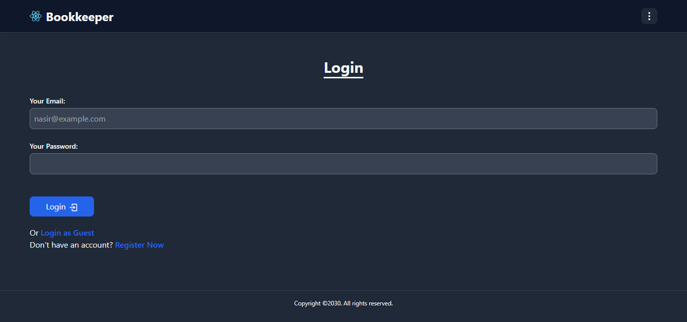
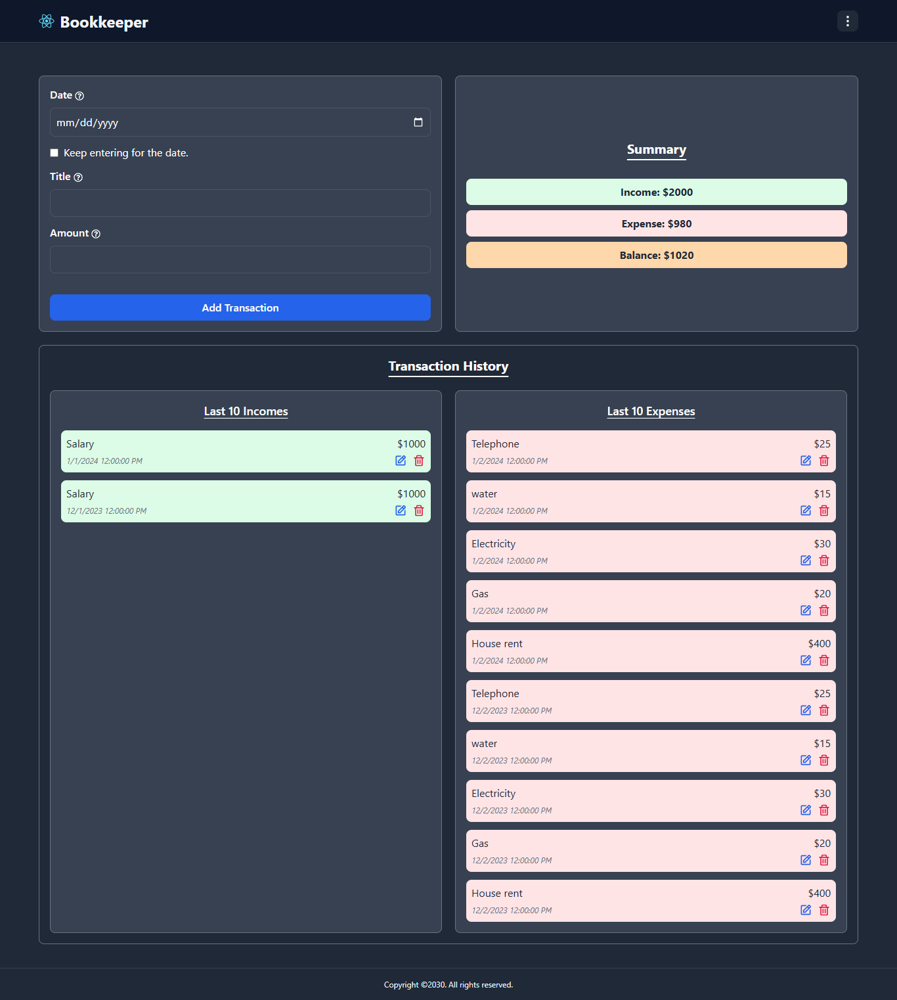
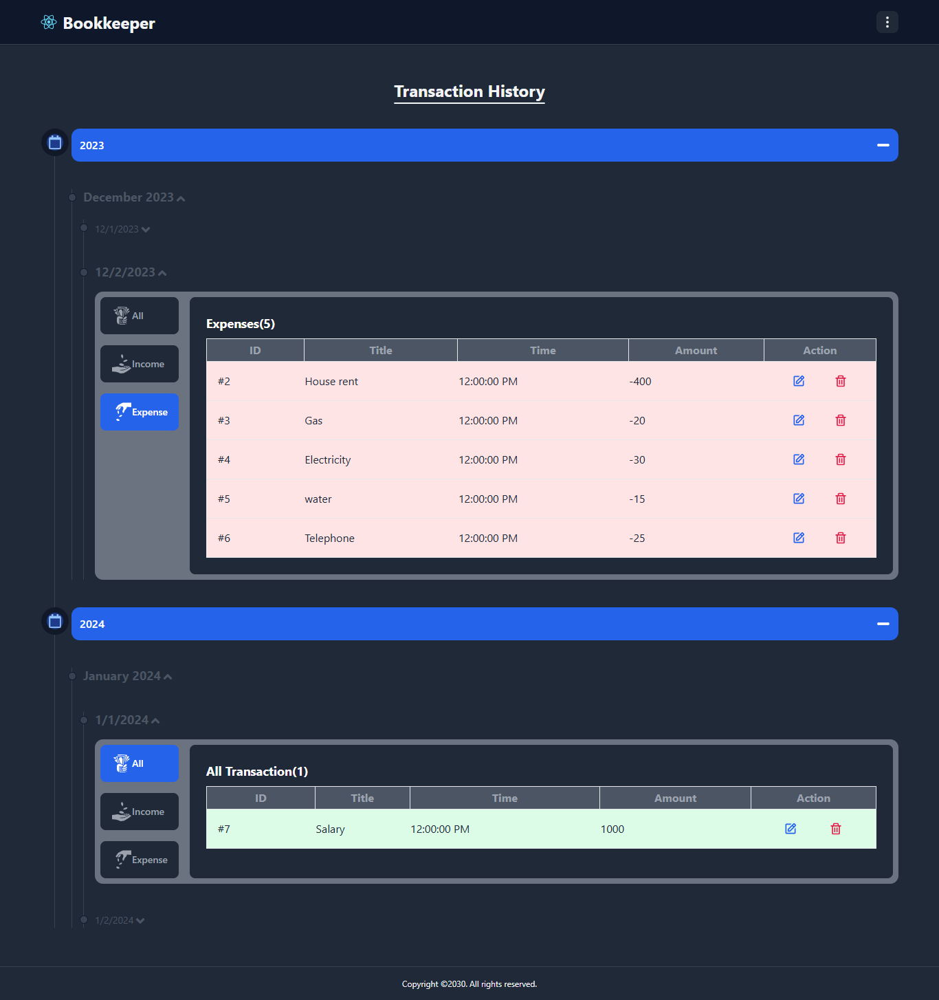
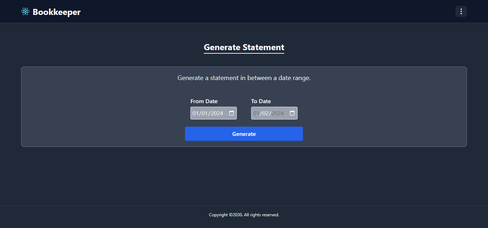
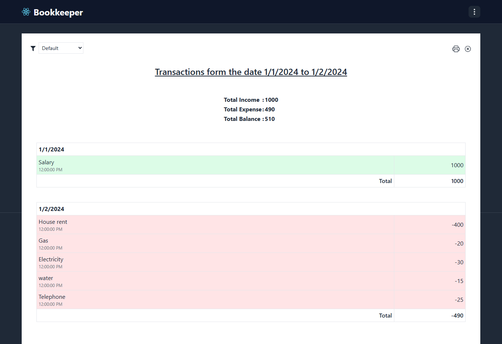
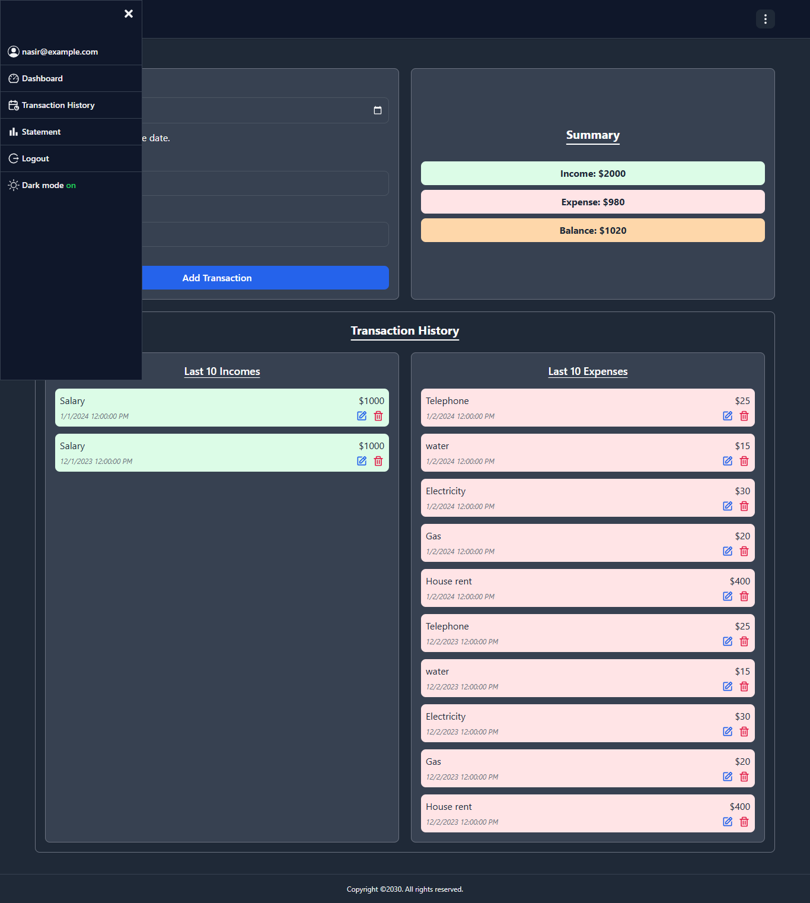
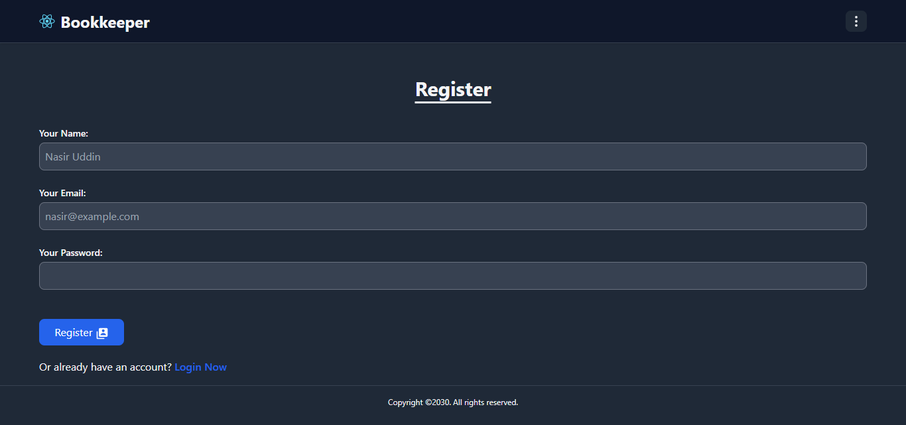

# 🧾 Bookkeeping Web App
A sleek and practical bookkeeping application built with React, Redux, and Tailwind CSS—designed to help users track and manage their financial transactions with ease. The app allows users to track and manage their transactions, with a feature to filter transactions by date. It also includes an option to generate reports based on transaction data, helping users keep a clear overview of their incomes and expenses. This project uses a mock JSON server to simulate backend functionality, making it ideal for demonstrating frontend architecture, state management, and user experience design.

<br>

## 🚀 Features
- Transaction Management: Add, edit, and delete income and expense entries.
- Date-Based Filtering: View transactions by specific dates to analyze spending patterns.
- Report Generation: Summarize financial activity to get a clear picture of income vs. expenses.
- JWT-Based Authentication: Simulated login flow to demonstrate secure access patterns.
- Responsive UI: Tailwind-powered design for clean, mobile-friendly layouts.

<br>

## 🛠️ Tech Stack
- Frontend: React.js, Redux, Tailwind CSS, HTML
- Mock Backend: JSON Server
- Authentication Flow: JWT (simulated)

<br/>

## 📚 What I Learned
This project helped me deepen my understanding of frontend architecture and simulated backend integration. Key takeaways include:
- State Management with Redux: I learned how to structure and manage complex application state across components, improving scalability and maintainability.
- JWT Authentication Flow: Implementing a simulated login system gave me hands-on experience with token-based authentication and protected routes.
- Mock Backend with JSON Server: Using JSON Server taught me how to simulate RESTful APIs, enabling rapid prototyping and frontend testing without a real backend.
- Date Filtering Logic: Building the date-based transaction filter sharpened my skills in handling dynamic data queries and conditional rendering.
- Report Generation: Designing the reporting feature helped me practice data aggregation and presentation techniques for user insights.
- Responsive UI Design: Tailwind CSS allowed me to create clean, mobile-friendly layouts while reinforcing utility-first styling principles.
- Environment Configuration: Setting up .env variables improved my understanding of separating config from code for flexibility and security

<br>

## 📦 Installation Guide

### Step 1: Frontend
```
# Clone the repo
git clone https://github.com/smshiplu/bookkeeper-react.git

# Install dependencies
cd bookkeeper-react
npm install
```

### Step 2: Backend
```
# Clone the repo
git clone https://github.com/smshiplu/bookkeeper-mock-server.git

# Install dependencies
cd bookkeeper-mock-server
npm install
```

### Step 3: Set Up Environment Variable
Create an .env file in the project root and paste variables.

```
REACT_APP_HOST=http://localhost:8000
REACT_APP_GUEST_EMAIL=nasir@example.com
REACT_APP_GUEST_PASSWORD=random
```

### Step 4: Start the Mock Backend (JSON Server)
```
# Start Backend
cd bookkeeper-mock-server
npm start
```
This will launch the backend at `http://localhost:8000`


### Step 5: Start the Frontend (JSON Server)
```
# Start Frontend
cd bookkeeper-react
npm start
```
This will launch the app at` http://localhost:3000`

<br>

## 🧪 Testing the App
- Add transactions and categorize them as income or expense.
- Use the date filter to view specific entries.
- Generate reports to visualize financial summaries

<br>

## 📸 Screenshots


---

---

---

---

---

---



